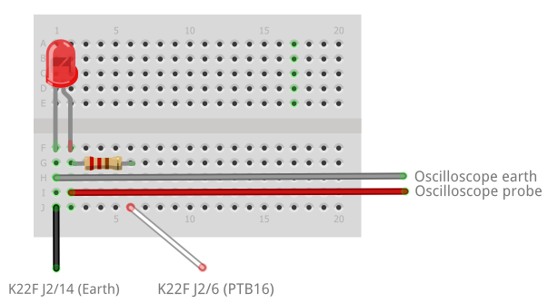

# coro-mc-wwl-code
C++20 Coroutines on Microcontrollers - What We Learned

## Overview

This repo contains projects that investigate the use, on resource-constrained embedded platorms, of the proposed C++ coroutine implementation N4680 (http://www.open-std.org/jtc1/sc22/wg21/docs/papers/2017/n4680.pdf). 

This code is referenced by our paper **"C++20 Coroutines on Microcontrollers - What We Learned"**.
The projects here form part of a larger codebase developed during a wider study into the use of coroutines on microcontrollers in C and C++. 
This set of projects is a freeze-frame of the larger work-in-progress.

## Dependencies

### Development

The following software was used for the development environment.

| Item | Version | Description |
|---|---|---|
| Windows | 7 | Operating system |
| Kinetis Design Studio | 3.2.0 | Integrated development environment, including build system |
| Processor Expert for Kinetis | 3.0.2 | Code generator |
| clang  | 8.0.0 | C/C++ compiler, including LLVM toolkit |
| g++? | ?? | Linker |

### Runtime

| Item | Version | Description |
|---|---|---|
| [FRDM-K22F](https://www.nxp.com/support/developer-resources/evaluation-and-development-boards/freedom-development-boards/mcu-boards/nxp-freedom-development-platform-for-kinetis-k22-mcus:FRDM-K22F) | N/A | NXP Semiconductors development board; 120 MHz, 512 kB Flash, 128 kB RAM |
| [Protothread.h](https://github.com/benhoyt/protothreads-cpp) | N/A | Ben Hoyt's C++ port of [Adam Dunkels' protothreads library](http://www.sics.se/~adam/pt/) |
| [MQX Lite](https://www.nxp.com/products/no-longer-manufactured/nxp-mqx-lite-real-time-operating-system-rtos:MQXLITE) | 1.1.1 | Real-time operating system |
| [FreeRTOS](https://www.freertos.org/) | 10.1.1 | Real-time operating system |

## Projects

This repo contains many similar projects to compare performance characteristics using different software environments. The projects are listed below 

| Project | Summary | Technology |
|---|---|---|---|
| [k22ptmin_xt](../master/k22ptmin_xt/readme.md) | Minimal project to investigate the cost of context switching using Protothreads. Uses an external timer. | Protothreads |
| [k22fawaitmin_xt](../master/k22fawaitmin_xt/readme.md) | Minimal project to investigate the cost of context switching using `co_await`. Uses an external timer. | Coroutines |
| [freertos2_xt](../master/freertos2_xt/readme.md) | Minimal project to investigate the cost of context switching using FreeRTOS and threads. Uses an external timer. | Threads |
| [mqxmin_xt](../master/mqxmin_xt/readme.md) | Minimal project to investigate the cost of context switching using MQX Lite and threads. Uses an external timer. | Threads |

The repo also contains other resources as follows;

[ProjectConfig.md](ProjectConfig.md) describes the common configuration of the KDS projects to to produce the project files listed above. Each project also contains a readme.md with project-specific configuration details.

## Circuit

All the projects use the same simple hardware layout. The external wires connected to the named pins on teh K22F development board. 


## See also

Other relevant resources can be found on the ISO C++ site:

| Document | Summary |
|---|---|
[N4775](http://www.open-std.org/jtc1/sc22/wg21/docs/papers/2018/n4775.pdf) | Working Draft, C++ Extensions for Coroutines |
[P1493 R0](http://www.open-std.org/jtc1/sc22/wg21/docs/papers/2019/p1493r0.pdf) | Coroutines: Use-cases and Trade-offs |

## License

This project is subject to the terms and conditions defined in file 'LICENSE' or 'LICENSE.txt', which is part of this source code package.


## Common components

The Processor Expert (PEx) tools were used to generate hardware access layer code wherever possible. Some of the steps for setting up the PEx components are unobvious, and are described below since they are common to all projects. 

### K22F CPU clock speed

1. Switch the Component Inspector to Advanced mode, without Tabs.
1. Clock settings > Clock source settings. Click minus until only 1 remains.
1. Clock settings > Clock source settings > Clock source setting 0. > External refernce clock.
1. OSC0ERCLK clock > `Enabled`
1. Clock settings > Clock source settings > Clock source setting 0. > MCG settings. 
1. MCG mode => `PEE` 
1. Clock settings > Clock source settings > Clock source setting 0. > MCG settings > PLL 0 settings. 
1. PLL output (MHz) => `120.0`
1. Clock settings > Clock configurations. Click minus until only 1 remains.
1. Clock settings > Clock configurations > Clock configuration 0 > System clocks.
1. Core clock => `120` (120 MHz)
1. Bus  clock => `60` (60 MHz)
1. External bus clock => `60` (60 MHz)
1. Flash clock => `24` (24 MHz)

## Common settings

### Parallel build

1. Project properties > C/C++ Build > Behavior tab.
1. Enable parallel build => `true`.

### Refresh policy

This needs to be fixed when projects are copied; otherwise the project will be rebuilt every time. 

1. Project properties > C/C++ Build > Refresh Policy tab.
1. Ensure that the only item in Resources is the current project.

### Artifact size

1. Project properties > C/C++ Build > Settings > Toolchains tab.
1. Print size => `true`

## Tool-chain

Here we alter the tool chain to use `LLVM/clang`.

If necessary, restart Kinetic Studio with `clang` in the PATH, e.g.:

```
set PATH=E:\llvm-trunk\install\bin;%PATH%
E:\Freescale\KDS_v3\eclipse\kinetis-design-studio.exe -data E:\Source\repos\K64F
```

Create a project configuration which uses `clang` as a compiler in place of `gcc`. 

### New configuration

1. Project > Build Configurations > Manage...
1. New...
1. Name: DebugLLVM; Copy existing settings from Debug. OK.
1. Select DebugLLVM and Set active.
1. Project > Properties > C/C++ Build > Settings
1. Ensure Configuration = DebugLLVM
1. C/C++ Build > Build Variables
1. Add ARM_INCLUDE => C:\Program Files (x86)\GNU Tools ARM Embedded\6 2017-q1-update\arm-none-eabi\include

### C++ Settings

1. C/C++ Build > Settings > Tool settings > Cross ARM C++ Compiler 
1. Command => clang++
1. Optimization > Language standard => Toolchain default (GNU ISO 1998 C++)
1. Optimization > ABI version => Toolchain default (2)
1. Optimization > Do not use exceptions => checked
1. Optimization > Do not use RTTI => checked.
1. Optimization > Do not use _cxa_atexit() => checked
1. Optimization > Do not use thread-safe statics => checked.
1. Miscellaneous > Other compiler flags => -fshort-enums -target armv7m-none-eabi "-fcoroutines-ts" "-stdlib=libc++" -std=c++14 
1. Tool settings > Cross ARM C++ Compiler > Includes
1. Add the following to the list:
    - "${ARM_INCLUDE}\c++\6.3.1\arm-none-eabi"
    - "${ARM_INCLUDE}\c++\6.3.1"
    - "${ARM_INCLUDE}"

### C Settings

1. Tool settings > Cross ARM C Compiler 
1. Command => clang
1. Miscellaneous > Other compiler flags => -fshort-enums -target armv7m-none-eabi
1. Includes. Add the following to the list:
    - "${ARM_INCLUDE}"
1. Change startup.c (see http://infocenter.arm.com/help/index.jsp?topic=/com.arm.doc.dui0774g/jhg1476893564298.html)
	```
	__attribute__((naked)) void __thumb_startup(void)
	```
	becomes:
	```
	#if defined (__clang__)
	void __thumb_startup(void)
	#else
	__attribute__((naked)) void __thumb_startup(void)
	#endif
	```
