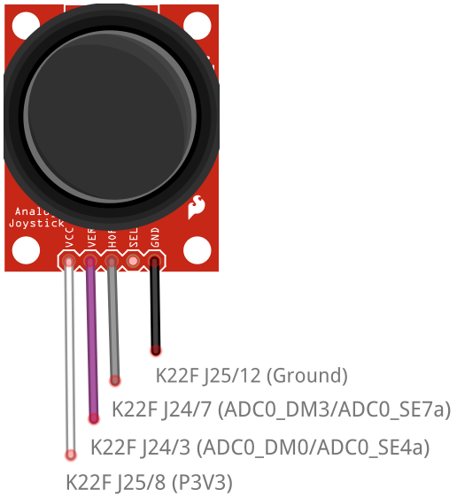

# coro-mc-wwl-code
C++20 Coroutines on Microcontrollers - What We Learned

## Overview

This repo contains projects that investigate the use, on resource-constrained embedded platforms, of the proposed C++ coroutine implementation N4680 (http://www.open-std.org/jtc1/sc22/wg21/docs/papers/2017/n4680.pdf). 

This code is referenced by our paper **"C++20 Coroutines on Microcontrollers - What We Learned"**.
The projects here form part of a larger codebase developed during a wider study into the use of coroutines on microcontrollers in C and C++. 
This set of projects is a freeze-frame of the larger work-in-progress.

## Dependencies

### Development

The following software was used for the development environment.

| Item | Version | Description |
|---|---|---|
| Windows | 7 | Operating system |
| Kinetis Design Studio | 3.2.0 | Integrated development environment, including build system |
| Processor Expert for Kinetis | 3.0.2 | Code generator |
| clang  | 8.0.0 | C/C++ compiler, including LLVM toolkit |
| gcc | 6.3.1 | Linker (arm-none-eabi-g++) |

### Runtime

| Item | Version | Description |
|---|---|---|
| [FRDM-K22F](https://www.nxp.com/support/developer-resources/evaluation-and-development-boards/freedom-development-boards/mcu-boards/nxp-freedom-development-platform-for-kinetis-k22-mcus:FRDM-K22F) | N/A | NXP Semiconductors development board; 120 MHz, 512 kB Flash, 128 kB RAM |
| [Protothread.h](https://github.com/benhoyt/protothreads-cpp) | N/A | Ben Hoyt's C++ port of [Adam Dunkels' protothreads library](http://dunkels.com/adam/pt/) |
| [MQX Lite](https://www.nxp.com/products/no-longer-manufactured/nxp-mqx-lite-real-time-operating-system-rtos:MQXLITE) | 1.1.1 | Real-time operating system |
| [FreeRTOS](https://www.freertos.org/) | 10.1.1 | Real-time operating system |

## Installation

1. Clone or copy the repo.
1. Open Kinetis Design Studio with clang/llvm on the PATH (see [ProjectConfig.md](ProjectConfig.md) for details).
1. (Optional) Create a new workspace.
1. Import the 4 projects from this repo into the active workspace.
1. Set the Active Build Configuration for each project as shown in the table below. 

| Project | Configuration |
|---|---|
| [k22ptmin_xt](./k22ptmin_xt/readme.md) | DebugLLVM_NS |
| [k22awaitmin_xt](./k22awaitmin_xt/readme.md) | DebugLLVM_NS |
| [freertos2_xt](./freertos2_xt/readme.md) | DebugLLVM |
| [mqxmin_xt](./mqxmin_xt/readme.md) | DebugLLVM |
| [k22fawait1](./k22fawait1/readme.md) | DebugLLVMc |
| [k22fawait2](./k22fawait2/readme.md) | DebugLLVMc |
| [k22ffsm2](./k22ffsm2/readme.md) | DebugLLVMc |

## Projects

This repo contains many similar projects to compare performance characteristics using different software environments. The projects are listed below. 

| Project | Summary | Technology |
|---|---|---|
| [k22ptmin_xt](./k22ptmin_xt/readme.md) | Minimal project to investigate the cost of context switching using Protothreads. Uses an external timer. | Protothreads |
| [k22awaitmin_xt](./k22awaitmin_xt/readme.md) | Minimal project to investigate the cost of context switching using `co_await`. Uses an external timer. | Coroutines |
| [freertos2_xt](./freertos2_xt/readme.md) | Minimal project to investigate the cost of context switching using FreeRTOS and threads. Uses an external timer. | Threads |
| [mqxmin_xt](./mqxmin_xt/readme.md) | Minimal project to investigate the cost of context switching using MQX Lite and threads. Uses an external timer. | Threads |
| [k22fawait1](./k22fawait1/readme.md) | Simple project to demonstrate microcontroller application development using `co_await`.  | Coroutines, Lambdas, some STL |
| [k22fawait2](./k22fawait2/readme.md) | Simple project to demonstrate microcontroller application development using `co_await` (second iteration). | Coroutines |
| [k22ffsm2](./k22ffsm2/readme.md) | Simple project to compare microcontroller application development using finite state machine against `co_await`. | FSM |

## Other contents

The repo also contains other resources as follows:

[ProjectConfig.md](ProjectConfig.md) describes the common configuration of the KDS projects that was performed in order to produce the project files listed above. (Each project also contains a readme with project-specific configuration details.)

[Library.md](Library.md) briefly describes the design and development of the run-time library.

## Circuits

### Context switching 

All the `*_xt` projects use the same simple hardware layout. The external wires are connected either to the named pins on the K22F development board or to the probe of the Rohde & Schwarz HMO2024 oscilloscope.

### Applications

The application projects (k22fawait1, k22fawait2 & k22ffsm2) use the same hardware layout. The external wires are connected either to the named pins on the K22F development board and to the pins of an analog PS2 game joystick (e.g. [Thumb Joystick - Sparkfun](https://www.sparkfun.com/products/9032) or [PS2 Game Joystick Module For Arduino - Banggood](https://www.banggood.com/PS2-Game-Joystick-Module-For-Arduino-p-76465.html?cur_warehouse=CN)).

## See also

Other relevant resources can be found on the ISO C++ site:

| Document | Summary |
|---|---|
[N4775](http://www.open-std.org/jtc1/sc22/wg21/docs/papers/2018/n4775.pdf) | Working Draft, C++ Extensions for Coroutines |
[P1493 R0](http://www.open-std.org/jtc1/sc22/wg21/docs/papers/2019/p1493r0.pdf) | Coroutines: Use-cases and Trade-offs |

## License

This project is subject to the terms and conditions defined in file 'LICENSE' or 'LICENSE.txt', which is part of this source code package.

