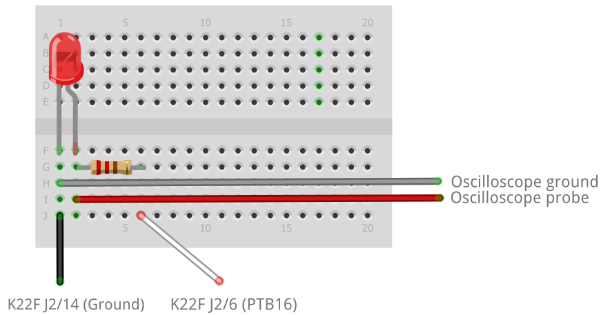

# coro-mc-wwl-code
C++20 Coroutines on Microcontrollers - What We Learned

## Overview

This repo contains projects that investigate the use, on resource-constrained embedded platforms, of the proposed C++ coroutine implementation N4680 (http://www.open-std.org/jtc1/sc22/wg21/docs/papers/2017/n4680.pdf). 

This code is referenced by our paper **"C++20 Coroutines on Microcontrollers - What We Learned"**.
The projects here form part of a larger codebase developed during a wider study into the use of coroutines on microcontrollers in C and C++. 
This set of projects is a freeze-frame of the larger work-in-progress.

## Dependencies

### Development

The following software was used for the development environment.

| Item | Version | Description |
|---|---|---|
| Windows | 7 | Operating system |
| Kinetis Design Studio | 3.2.0 | Integrated development environment, including build system |
| Processor Expert for Kinetis | 3.0.2 | Code generator |
| clang  | 8.0.0 | C/C++ compiler, including LLVM toolkit |
| g++? | ?? | Linker |

### Runtime

| Item | Version | Description |
|---|---|---|
| [FRDM-K22F](https://www.nxp.com/support/developer-resources/evaluation-and-development-boards/freedom-development-boards/mcu-boards/nxp-freedom-development-platform-for-kinetis-k22-mcus:FRDM-K22F) | N/A | NXP Semiconductors development board; 120 MHz, 512 kB Flash, 128 kB RAM |
| [Protothread.h](https://github.com/benhoyt/protothreads-cpp) | N/A | Ben Hoyt's C++ port of [Adam Dunkels' protothreads library](http://www.sics.se/~adam/pt/) |
| [MQX Lite](https://www.nxp.com/products/no-longer-manufactured/nxp-mqx-lite-real-time-operating-system-rtos:MQXLITE) | 1.1.1 | Real-time operating system |
| [FreeRTOS](https://www.freertos.org/) | 10.1.1 | Real-time operating system |

## Projects

This repo contains many similar projects to compare performance characteristics using different software environments. The projects are listed below 

| Project | Summary | Technology |
|---|---|---|
| [k22ptmin_xt](../master/k22ptmin_xt/readme.md) | Minimal project to investigate the cost of context switching using Protothreads. Uses an external timer. | Protothreads |
| [k22fawaitmin_xt](../master/k22fawaitmin_xt/readme.md) | Minimal project to investigate the cost of context switching using `co_await`. Uses an external timer. | Coroutines |
| [freertos2_xt](../master/freertos2_xt/readme.md) | Minimal project to investigate the cost of context switching using FreeRTOS and threads. Uses an external timer. | Threads |
| [mqxmin_xt](../master/mqxmin_xt/readme.md) | Minimal project to investigate the cost of context switching using MQX Lite and threads. Uses an external timer. | Threads |

The repo also contains other resources as follows;

[ProjectConfig.md](ProjectConfig.md) describes the common configuration of the KDS projects that was performed in order to produce the project files listed above. Each project also contains a readme.md with project-specific configuration details.

## Circuit

All the projects use the same simple hardware layout. The external wires connected to the named pins on the K22F development board. 

## See also

Other relevant resources can be found on the ISO C++ site:

| Document | Summary |
|---|---|
[N4775](http://www.open-std.org/jtc1/sc22/wg21/docs/papers/2018/n4775.pdf) | Working Draft, C++ Extensions for Coroutines |
[P1493 R0](http://www.open-std.org/jtc1/sc22/wg21/docs/papers/2019/p1493r0.pdf) | Coroutines: Use-cases and Trade-offs |

## License

This project is subject to the terms and conditions defined in file 'LICENSE' or 'LICENSE.txt', which is part of this source code package.

